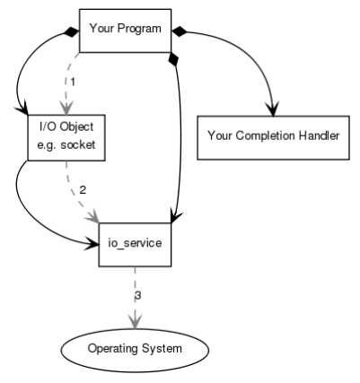

When an asynchronous connect operation is performed, the following sequence of events occurs:
- **Your program** initiates the connect operation by calling the **I/O object**.

```C++
socket.async_connect(server_endpoint, your_completion_handler);
```

where your_completion_handler is a function or function object with the signature: 

```C++
void your_completion_handler(const boost::system::error_code& ec);
```

The exact signature required depends on the asynchronous operation being performed.

- The **I/O object** forwards the request to the **io_service**.
- The **io_service** signals to the **operating system** that it should start an asynchronous connect. Time passes. 
- The **operating system** indicates that the connect operation has complete by placing the result on a queue, ready to be picked up by the **io_service**.
- **Your program** must make a call to io_service::run() (or to one of the similar **io_service** member functions) in order for the result to be retrieved. A call to io_service::run() blocks while there are unfinished asynchronous operations, so you would typically call it as soon as you have started your first asynchronous operation.
- While inside the call to io_service::run(), the **io_service** dequeues the result of the operation, translates it into an error_code, and then passes it to **your completion handler**.




