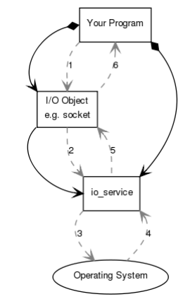

When a synchronous connect operation is performed, the following sequence of events occurs:
- **Your program** initiates the connect operation by calling the **I/O object**.
- The **I/O object** forwards the request to the **io_service**.
- The **io_service** calls on the **operating system** to perform the connect operation.
- The **operating system** returns the result of the operation to the **io_service**.
- The **io_service** translates any error resulting from the operation into a *boost::system::error_code*. An *error_code* may be compared with specific values, or tested as a boolean (where a false result means that no error occurred). The result is then forwarded back up to the **I/O object**.
- The **I/O object** throws an exception of type boost::system::system_error if the operation failed. If the code to initiate the operation had instead been written as: 

```C++
boost::system::error_code ec; 
socket.connect(server_endpoint, ec);
```

then the error_code variable ec would be set to the result of the operation, and no exception would be thrown. 



Notice: 
- **Your program** will have at least **io_service** object.The **io_service** represents **your program**'s link to the **Operating system**'s I/O services. 
- To perform I/O operations **Your program** will need an **I/O object**.